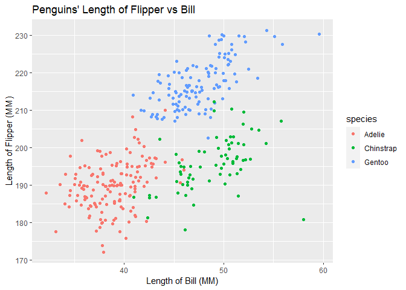

p8105\_hw1\_zl2974
================
ZHuohui(Jeffrey) Liang, Github:zl2974
2020/9/15

# Solution For Problem 1

*Create a data frame*

``` r
df_1 <- tibble(
  samp = rnorm(10),
  samp_grt_0 = samp > 0,
  char = strsplit("thesereten",split = '')[[1]],
  fac = factor(strsplit("abcabcacba", split = '')[[1]]) #what i am confusing here is that this function create list, and list() and c() behave so inconsistantly in R, is there any good sugguestion to avoid list() overall? Or good way to detected before bugging?
)
str(df_1)
```

    ## tibble [10 x 4] (S3: tbl_df/tbl/data.frame)
    ##  $ samp      : num [1:10] 0.13 0.741 1.148 -1.661 1.582 ...
    ##  $ samp_grt_0: logi [1:10] TRUE TRUE TRUE FALSE TRUE FALSE ...
    ##  $ char      : chr [1:10] "t" "h" "e" "s" ...
    ##  $ fac       : Factor w/ 3 levels "a","b","c": 1 2 3 1 2 3 1 3 2 1

# Solution to Problem 2

Load and clean dataset

``` r
data("penguins",package = "palmerpenguins")
```

In this dataset, we’ve seen a 344 \* 8 size, in which contains column’s
variables eg. *species, island, bill\_length\_mm, bill\_depth\_mm,
flipper\_length\_mm, body\_mass\_g, sex, year*.In the
**flipper\_length\_mm** we are going to discuss, we see that this
variable is a integer type variable(195, 207, 202, 193, 210, 198). Also
we need to see **species**, which is a factor type data, with level of
*Adelie, Gentoo, Chinstrap*.

And the following is the detailed descriptive statistics of penguins
data.

``` r
skimr::skim_without_charts(penguins)
```

|                                                  |          |
| :----------------------------------------------- | :------- |
| Name                                             | penguins |
| Number of rows                                   | 344      |
| Number of columns                                | 8        |
| \_\_\_\_\_\_\_\_\_\_\_\_\_\_\_\_\_\_\_\_\_\_\_   |          |
| Column type frequency:                           |          |
| factor                                           | 3        |
| numeric                                          | 5        |
| \_\_\_\_\_\_\_\_\_\_\_\_\_\_\_\_\_\_\_\_\_\_\_\_ |          |
| Group variables                                  | None     |

Data summary

**Variable type: factor**

| skim\_variable | n\_missing | complete\_rate | ordered | n\_unique | top\_counts                 |
| :------------- | ---------: | -------------: | :------ | --------: | :-------------------------- |
| species        |          0 |           1.00 | FALSE   |         3 | Ade: 152, Gen: 124, Chi: 68 |
| island         |          0 |           1.00 | FALSE   |         3 | Bis: 168, Dre: 124, Tor: 52 |
| sex            |         11 |           0.97 | FALSE   |         2 | mal: 168, fem: 165          |

**Variable type: numeric**

| skim\_variable      | n\_missing | complete\_rate |    mean |     sd |     p0 |     p25 |     p50 |    p75 |   p100 |
| :------------------ | ---------: | -------------: | ------: | -----: | -----: | ------: | ------: | -----: | -----: |
| bill\_length\_mm    |          2 |           0.99 |   43.92 |   5.46 |   32.1 |   39.23 |   44.45 |   48.5 |   59.6 |
| bill\_depth\_mm     |          2 |           0.99 |   17.15 |   1.97 |   13.1 |   15.60 |   17.30 |   18.7 |   21.5 |
| flipper\_length\_mm |          2 |           0.99 |  200.92 |  14.06 |  172.0 |  190.00 |  197.00 |  213.0 |  231.0 |
| body\_mass\_g       |          2 |           0.99 | 4201.75 | 801.95 | 2700.0 | 3550.00 | 4050.00 | 4750.0 | 6300.0 |
| year                |          0 |           1.00 | 2008.03 |   0.82 | 2007.0 | 2007.00 | 2008.00 | 2009.0 | 2009.0 |

To make a scatterplot of flipper and bill’s lengh, first I made a
plt\_data to collect return result of cleaned penguins dataset( which
contains 19 missing data). And save the result under the same dictionary
of RMD files.

``` r
plt_data = penguins %>%
  filter(
    !is.na(get("flipper_length_mm")),
    !is.na(get("bill_length_mm"))
  )%>%
  select("flipper_length_mm","bill_length_mm","species")
plt_flivbil <- ggplot(
  data  = plt_data,
  aes_string(x = "bill_length_mm",
             y = "flipper_length_mm",
             color = "species"
             )) +
  geom_jitter() +
  labs(
    y = "Length of Flipper (MM)",
    x = "Length of Bill (MM)"
  )+
  ggtitle("Penguins' Length of Flipper vs Bill")
ggsave(plot = plt_flivbil,
filename = paste(here::here(),"Result/p8105_hw1_zl2974_flipper_v_bill.png",sep="/")
)
show(plt_flivbil)
```

<!-- -->

As we see in this scatter plot, the length of flipper and bill shows
concentration within their species, Adelle has the lower length of
flipper and bill compared with Gentoo. Chinstrap has similar length of
bill with Gentoo and similar length of flipper with Adelle.
